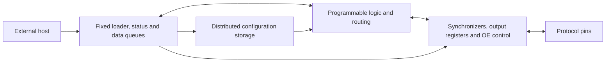

# WARP architecture review and experiment plan

2026-09-25 · `anish_branch` · phase-0 research and tooling.

## Recommendation

Continue with a **small FABulous-based eFPGA plus a fixed management and
data shell** as the leading hypothesis. First prove the existing toolchain;
then select the simplest fabric that meets a declared workload. Do not
build a new placer/router, add an on-chip CPU just to load configuration,
or commit to a catalog of custom primitives before profiling.

The best design is the one that runs useful, independently checked user
designs within 6x4 after routing. We do not yet have evidence that WARP
beats TRIPWIRE or a PIO-style engine. A CPU is not mandatory for a runtime
configurable machine technically; competition eligibility still needs
the organizer's answer to the [draft questions](../notes/organizer_questions.md).

This document refines the experiments, not the hardware contract.
`ARCHITECTURE.md` remains a phase-1 deliverable; no proposed shell behavior
here is implemented or frozen. Existing phase gates still apply.

## What the repository already establishes

| Direction | Evidence inspected | What remains unproved |
|---|---|---|
| `main`: TRIPWIRE | Cycle model, compiler, protocol peers; R1 synthesis/STA; R2 routed lane and R3 SRAM reports | Complete integrated-chip RTL and its routed performance |
| `efpga`: WARP | Phase plan, template counter, setup/check scripts | Working reference bitstreams, useful fabric capacity, shell, protocol mapping and physical fabric |
| This branch | Starts at WARP `a63877d`; exact requested name `anish_branch` | Experiments below must earn their results |

The histories of `main` and `efpga` are unrelated. Preserve both; use explicit
source references rather than merging their architecture contracts.
TRIPWIRE reports at [`4be3466`](https://github.com/Kanishk234/protocol-emulator-asic/tree/4be3466c68fe1085523d18ae93994b6188f7ffc3)
are evidence from the other branch, not measurements rerun here. In
particular, [R2's area report](https://github.com/Kanishk234/protocol-emulator-asic/blob/4be3466c68fe1085523d18ae93994b6188f7ffc3/docs/reports/AREA.md)
records three failed routing attempts before a 4x2 lane experiment passed.
That is a reason to measure wire congestion early, not a fabric area model.

The original September 22 survey is useful historical context. Its
competitor claims are not verified results, the 66 MHz GPIO figure is not
a CMOS5L guarantee, and support for 8x4 in tooling does not change the
[published competition budget](https://blog.janestreet.com/protocol-emulator-asic-competition/).

## Architectural choices

| Candidate | Main advantage | Main cost or risk | Decision |
|---|---|---|---|
| Generic LUT4+FF fabric, existing carry support | Familiar HDL, spatial concurrency, existing mapping flow | Configuration and switch boxes can dominate area/wires | Establish G0 baseline |
| Same fabric with selected general primitives | Can remove repeated counters/shifters or FIFO glue | Extra routing, unused silicon, mapping and verification burden | Add one at a time only after full-flow measurements |
| Coarse state/datapath engine, including TRIPWIRE | Shares arithmetic/state storage efficiently | Restricted operations and scheduling; another programming model | Retain as capacity fallback/comparison |
| CPU plus fabric | Convenient upper-layer software | Two architectures, program memory, interconnect and verification cost | Defer unless a workload specifically requires autonomous software |
| Entirely custom FPGA CAD stack or multicontext fabric | More architecture freedom | Tooling and configuration bandwidth can consume the schedule | Exclude from first submission |

PRISM already demonstrates a Verilog-programmed protocol state engine;
Tiny FABulous already demonstrates a Tiny Tapeout FPGA. See [prior art](../notes/prior_art.md).
Our contribution must be measurable usefulness and trustworthy execution.

## Seven questions that determine the chip

1. **What useful workload fits?** Count controller state, registers, timers,
   comparators, routing, buffering and host adapters. A bare UART shifter
   is not a UART peripheral. Define each role's exact semantics before
   collecting scores; separately report standalone and concurrent designs.
2. **What costs a logic cell physically?** A LUT4 requires 16 truth-table
   bits before routing/FF-mode bits. Configuration is distributed state:
   an ordinary narrow-port SRAM macro cannot simultaneously drive all
   static mux selects. SRAM is a candidate for queues or saved bitstreams;
   using it for active configuration requires another architecture and
   its own access, wiring and area accounting.
3. **Does the timing model match silicon?** ASIC STA of the fabric and
   nextpnr timing of a user route answer different questions. Characterize
   primitive and route arcs, constrain shell crossings, and validate the
   configured routes after physical implementation. A blanket false path
   through programmable logic would conceal the functionality we need.
4. **Can the host feed and drain it?** State separate peak pin rates,
   sustained payload throughput, burst capacity and host-service limits.
   If producer rate is R and host stalls for T, usable buffer capacity must
   be at least R*T plus framing/latency allowance. For example, full-duplex
   12.5 MHz SPI is 1.5625 MB/s in each direction before host overhead; this
   is arithmetic for budgeting, not an achieved WARP rate. A faster fabric
   does not fix a slower host link.
5. **What is external reaction latency?** Include asynchronous-input
   synchronization, edge detection, user logic, output registering and pad
   timing. One state transition per clock is not one-clock pin response.
   Define whether an external clock is sampled data or a supported clock
   domain. Start with one system clock and clock enables; no LUT clocks.
6. **What happens during a failed reload?** Park outputs and block RUN
   before loading, validate architecture/version/length/checksum, clear
   configuration validity on every interrupted load, then explicitly
   initialize user state. A checksum checks transport corruption, not
   electrical safety of arbitrary configurations. Prove the loading order
   cannot leave active combinational loops; output gating alone is
   insufficient. Rollback is not promised without storage for another image.
7. **Can a new user design actually be programmed?** Every primitive needs
   HDL inference or documented instantiation, mapping, placement, routing,
   bit generation and a dynamic-load test. Count engineering time as a
   real cost; remove resources the tools cannot reliably use.

## Proposed shell boundary for phase 1

Keep boot/configuration control independent of the user circuit. Proposed
minimum: version and capability registers; bounded LOAD/STOP/START
commands; configuration validity; sticky error reporting; a small
ready/valid queue interface; documented reset and overflow behavior.
Evaluate shell queue cost and bandwidth before selecting FIFO depths.
Open-drain output mode should drive low or release, with output-enable
parking enforced outside user logic. Test simultaneous management and
protocol traffic. Debug readback and tracing compete with usable fabric
area and must be budgeted rather than added for free.

## Experiments and acceptance criteria

The percentages below are proposed engineering margins, not measurements
or foundry requirements. Review them at the phase-1 gate.

| Gate | Experiment | Evidence required / failure response |
|---|---|---|
| P0-A | Pinned upstream reference, two different user designs | Real generated bitstreams, dynamic load and independent behavioral checks on the same generated fabric; no constant emulation. Keep the simulation process alive across reloads when claiming reload correctness. |
| P0-B | Enumerate reference configuration | Separate LUT/primitive, switch-matrix and frame padding costs. Treat this as a structural census, not placed area. |
| P0-C | Document CMOS5L integration path | Small flat fabric first; macro route only with correct PDK views and approval. GDS/precheck/GL remain separate gates. |
| P1-A | Seal evaluation scope before profiling | Do not train on purported held-out protocols. Prior TRIPWIRE exposure must be disclosed; use untouched implementations/scenarios and avoid claiming a fully blind architecture study. |
| P1-B | UART TX/RX, SPI controller all modes, I2C controller and target | Independent peers, normal/errors/backpressure, explicit rates, widths and buffer sizes. Generic LUT3/4/6 counts screen options; actual FABulous mapping/routes decide feasibility. |
| P1-C | Live-configured small fabric through CMOS5L | Correct storage survives synthesis; representative configuration toggles in GL; timing, DRC/LVS, congestion, runtime and cell breakdown. Extrapolation must include boundary/shell overhead. |
| P1-D | Capacity and throughput decision by Oct 25 | All required roles fit independently. Target at least 20% uncommitted LUT/FF capacity for the chosen composite workload and declared buffering budget; route all chosen seeds and meet the same timing constraints. Reduce scope or use fallback if unavailable. |
| P2 | Harden G0 plus working shell | A usable baseline before any customization: real loading, host queues, error behavior, documented source-to-bitstream flow. |
| P3 | One specialization at a time | Equal total die allocation, PDK, shell, clock, buffers and protocol semantics. Report routing success for all seeds, non-user penalty and tool support. Retain G0 unless a variant supplies a concrete system benefit. |
| P4 | Freeze then evaluate held-out set | Add user bitstreams only; no hardware, mapper or route-model tuning to rescue failures. Log unsupported cases and any necessary unfreeze. |
| P5/6 | Reproduce and package by Jan 11 | Fresh checkout builds, source provenance, exact bitstream/fabric hashes, timing scope and all required template checks; Jan 18 official deadline. |

For P3 use a small fixed seed set (for example 1, 2, 3, 4, 5), retain all
outcomes, and compare worst successful timing as well as median. A failed
route is a result, not a reason to discard a seed. Do not compare the
entire TRIPWIRE Python model with a tiny mapped WARP datapath and call it
an equal-area hardware result.

Promising candidates to **measure**, in order: FF/reset/enable packing,
carry-supported timer/comparator mapping, configurable shift/capture
resources, then storage/CRC only if the design set justifies them. Avoid
adding every attractive primitive. Fewer configurable routing choices can
save more than arithmetic specialization, but must preserve routability.

## Verification that makes the result credible

Use independent protocol peers at the source and configured-fabric layers.
Tie each run to source, architecture, tool and bitstream hashes. Check
payloads **and timing**, including start/stop/ACK edges and output-enable
turnarounds. Propagate X failures; do not initialize internal silicon state
in the testbench to conceal a missing reset/configuration sequence.

Add negative controls at the boundaries: altered LUT truth bit, swapped
routing select, truncated load, wrong architecture ID, stalled host and
FIFO overflow. A test suite must reject a deliberately wrong circuit.
Formal claims name the property and bound (or induction result); bounded
checks of a loader do not verify every possible user circuit.

Keep ASIC-fabric sign-off and configured-user timing evidence separate.
Fabric structural loops and latch configuration can need justified timing
exceptions, but exceptions must never remove real user data paths from
analysis. Release only a documented user-HDL subset with supported clock,
reset and inference rules.

## Immediate next actions

Finish the phase-0 reference flow and configuration census, add unit CI,
record exact successes/failures, and send the draft organizer questions
when a team member is ready. Then finish the existing phase-0 exit checks.
Do not begin the phase-1 protocol profiling or declare the phase complete
merely because a research document or a counter test passes.
