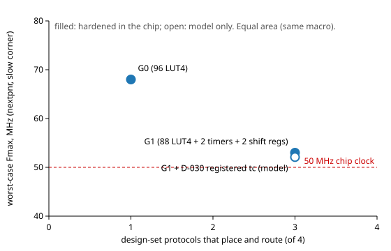

# Architecture comparison at equal area (phase 3)

**Date:** 2026-09-28 · **Rule:** D-004: variants are compared at equal total area and the same clock target (50 MHz). Every variant here uses the same chip: the same shell, the same fabric macro size (1016.64 × 669.06 µm) and placement, the same configuration path; only the content of one 4 × 3 tile slot differs, and the primitive tile is 0.97 × a LUT tile's standard-cell area in the same footprint (D-026). **Metrics:** coverage = design-set protocols that place and route on the fabric (of 4: UART, SPI controller, I2C controller, I2C target); performance = the worst nextpnr Fmax estimate among those that fit (slow corner, timing model of `tools/timing/README.md`; a model, not a claim).

| Variant | Built? | Fabric logic | Fits | Logic cells (UART / SPI / I2C ctrl / I2C target) | Worst Fmax (MHz) | Evidence |
|---|---|---|---|---|---|---|
| **G0** | hardened in the chip (CI 36353540402) | 96 LUT4 | 1 of 4 (SPI) | 124 / **86** / 115 / 184 | 68.0 (SPI) | `docs/reports/g0_results.md` |
| **G1** | hardened in the chip (CI 36376994834) | 88 LUT4 + 2 timers + 2 shift registers | **3 of 4** | **29 / 47 / 70** / 169 | 53.0 (I2C controller) | `docs/reports/g1_results.md`, D-026 |
| G1 + registered terminal count (D-030) | primitive RTL proven (F4); timing from STA, not hardened | same as G1 | 3 of 4 | same as G1 | 52.1 (I2C controller); UART 90.7 → 100.5 | D-030 |
| G1 + primitive tile with design repair (D-031) | not feasible (tile placement fails) | - | - | - | - | D-031 |
| G1 + LUT tiles with 2 control sets | not built | - | would not change fits: 3–7 control sets per design vs 11 LUT tiles | - | - | `docs/reports/g1_limits.md` |
| G1 + second primitive tile | not built | 80 LUT4 + 4 + 4 | design set uses ≤ 2 + 2 blocks; the I2C controller (70 LCs) would be at 88 % of 80 | - | - | `docs/reports/g1_limits.md` |
| G1 + register-file tile (D-034) | measured by synthesis (tile library `RAM_32x4_2R_1W` ×2) | 80 LUT4 + register file | 3 of 4: I2C target 123 LCs (4 registers) / 110 (2) of 80 | - | - | D-034 |

## What the comparison says

- **G1 dominates G0** at equal area: three protocols instead of one, and every one of them above the 50 MHz clock in the model. The price is 8 LUT4s of general logic and a lower worst-case Fmax (53 vs 68 MHz, the I2C controller being a larger design than the SPI controller that is G0's only fit).
- **No measured candidate improves on G1 for the design set.** D-030 moves UART up but not the worst design; D-031 does not fit; the unbuilt ones fail on the data before building (the phase 3 method's step 7: kept only if the measured benefit justifies the cost).
- **Open limits** that a different fabric would have to address: the I2C target (about twice G1's logic) and the I2C controller's timing margin (53 MHz model estimate vs 50 MHz).

## Not covered here
- The held-out protocols (phase 4) are not in these numbers, by design (D-003). Whether G1's primitives generalize is phase 4's result, measured on the frozen chip against a G0 build.
- Area and power beyond standard-cell area (routing, configuration storage) are the same for all rows, since the macro and shell are identical.
